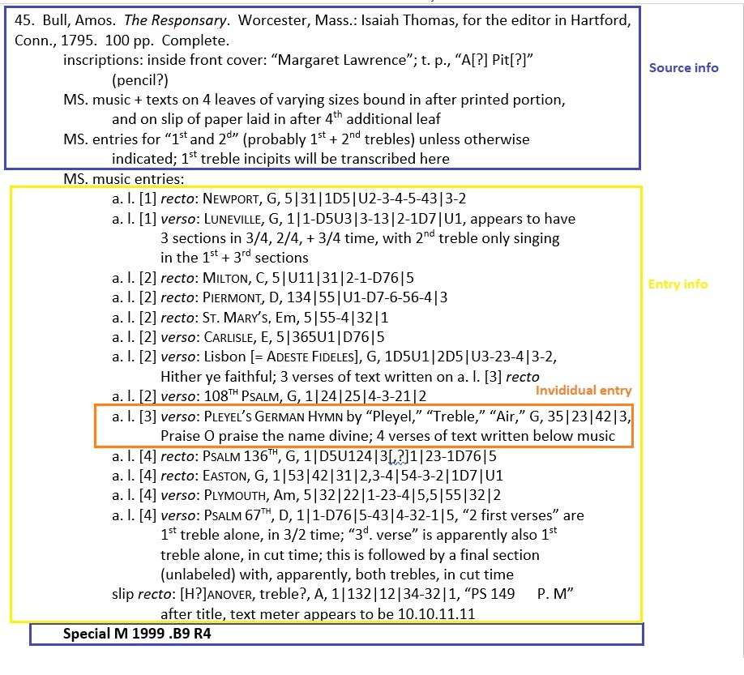

Parse Music Entries
===================

An application for parsing music inventories recorded with Microsoft Word into cellular format using Java, Apache POI, and MySQL.

Background
----------

This project began with a conversation between myself and the author of the music inventory documents, Nym. Nym is a retired music teacher, and a leading scholar in the field of Antiquarian music. He explained how he was visiting numerous libraries and recording information about Antiquarian music. He said he was recording this information into Word documents, and had an interest in sharing the data one day.

At this point, I had been a year and a half into my journey towards becoming a programmer. I explained to Nym that the ideal way to store and share this data would be with a database. I asked Nym to provide me with examples of how he was recording this information to see if we could find a pattern. It turned out that there were reliable patterns to how he was recording his data. This turned out to be the start of my first major learning project as a programmer.

Over the following months, Nym and I collaborated extensively to accomplish the task of parsing his music inventories, which amounted to hundreds of pages worth of Word documents. The patterns were not as concrete as they had initially seemed, but they were good enough, and eventually, we compiled Nym's music inventory database. 

The music inventory database then served as the foundation for the [Music Inventory Web project](https://github.com/2human/music-inventory-web), and later, the [fully rewritten React version](https://github.com/2human/music-inventory-web-react) of the same application.

Overview
------------

Music inventories are comprised of three types of data: collections, sources, and entries.

* Collections constitute a group of sources at a specific location, e.g. a library or a personal collection of musical sources. This data type 
will contain a broad description pertaining to a musical collection as a whole. Fields include collection name, and collection description.

* Sources are individual books of musical information contained within a collection. A collection may contain hundreds of sources. Fields include the collection
within which it is contained, the author, its title, inscriptions, call number, and a miscellaneous information about the source known as its description.

* Entries are individual musical pieces contained within musical sources. Sources may contain many entries, or none at all. Data types include the entry's location 
within its location (e.g, page number), title, author, vocal part, key, melodic incipit (musical nottes), and text incipit (lyrics).

The bulk of the data parsed consists of sources/entries in the format shown here. The collection information consists of all data concerning the collection which precedes the first source, and is trivial. As such, the primary task of the program is to iterate over data like that above, and parse it based on patterns established by the recorder. These patterns consist of text formatting, delimiters, and keywords.

The above source would be parsed as such:

number: 45  
author: Bull, Amos 
title: The Responsary  
inscriptions: inside front cover: "Margaret Lawrence"; t. p., "A[?] Pit[?]"  
&emsp;&emsp;&emsp;&emsp;&emsp;&emsp;&emsp;(pencil?)  
description: MS. music + texts on 4 leaves of varying sizes bound in after printed portion,  
&emsp;&emsp;&emsp;&emsp;&emsp;&emsp;&emsp;and on slip of paper laid in after 4th additional leaf  
&emsp;&emsp;&emsp;&emsp;&emsp;&ensp;MS. entries for "1st and 2d" (probably 1st + 2nd trebles) unless otherwise  
&emsp;&emsp;&emsp;&emsp;&emsp;&emsp;&emsp;indicated; 1st treble incipits will be transcribed here  
call number: Special M 1999 .B9 R4  

Parsing Sources
---------------

The logic consists of first finding the beginning of a new source. This is done using a regular expression which detects an integer followed by a period.

After that, the title, as indicated by the first occurrence of italicized text, is found.

The Apache POI library groups text from Word documents first by paragraph, which can be accessed as an array of paragraph objects. Within each paragraph is another array of objects called "text runs". Text runs are segments of text with common formatting. Text runs can be checked for different types of formatting, such as italicization, bolding, small caps, etc...

As such, the source title can be found by iterating over the text run array until the first italicized text run is found.

The author is simply the text that occurs between the source number and title. Once the title is found, the program naturally knows what the author is.

Inscriptions are denoted by either 'inscriptions:' or 'inscription:'. Inscriptions are always contained within a single paragraph. Therefore, once either of these terms are found, it is known that the rest of the paragraph contains the inscription text.

The call number is found at the bottom of the source, and is indicated by bold text. Finding the call number is similar to finding the source. Text runs are analyzed for bold formatting, and boldened text runs are recorded as the call number.

All remaining text, entry info notwithstanding, is compiled into the 'description' column. 

While the program is parsing the source, it is also attempting to detect for the presence of entries. Typically, sections of music entries are indicated by the text "MS. music entries:". However, this is not always the case, as the author of the music inventory Word documents was not compiling these documents with the intention of having them parsed by a computer program. Because of this, it was necessary to create an algorithm that checked for other, more subtle indicators of entries sections.

Once a section of entries has been detected, entry parsing operations commence. Entry parsing is the most involved, complex aspect of the application.

Parsing Entries
---------------

The highlighted individual entry in the example above would be parsed as such:

location: a. l. [3] verso  
title: Pleyel's German Hymn  
author: by "Pleyel"  
vocal part: "Treble," "Air"  
key: G  
melodic incipit: 35|23|42|3  
text incipit: Praise O praise the name divine  
description: 4 verses of text written below music  
secular: false

The first step is to separate the content of each entry into an array of RoughEntry objects. A RoughEntry object contents the text for an entry as a string, as well as a boolean value for whether the entry is a secular musical piece. The entry text contained within the RoughEntry objects are created by iterating over the entry section using a stringbuilder, appending the text of each paragraph object to the current entry until a new entry is found, and repeating the process until the end of the entries section is found. New entries are detected by the presence of a colon, which occurs after the location of a new entry.

Non-secular entries are indicated by the use of small caps in the the title. So in order to find small caps, each text run is analyzed for the presence of small caps, and if none are present, it is deemed secular. In the example above, 'Pleyel's German Hymn' is in small caps, making it secular.

After that, each RoughEntry is fully parsed into an Entry object, wherein the data is separated into its appropriate fields.

The location of the entry can be found right away by recording the text that precedes the first colon in the entry text. Then, the rest of the entry text is split into an array using the Array.split() method, with the comma as a delimiter.

The title and author both occor before the first comma. There are various keywords, including 'by' and 'att' which indicate the start of the author. Any text preceding those occurrence of those keywords is parsed as the title.

When the entry text is split according to the occurrence of commas, one of the problems is that commas can act as false delimiters as the fields are concerned. For example, "Treble" and "Air" both belong in 'vocal part' field, but they are still separated by commas. The program solves this problem through the detection of the limited number of keywords which can occur in the vocal part field, shifting the array and combining vocal parts as appropriate. There are also cases where no vocal parts are present in the entry, where the array must also be shifted accordingly.

The piece of data to parse is the key. The key occurs after the vocal part, and before the melodic incipit. There was no reliable way to identify data for the key. There were also cases where no key was present in the entry. However, melodic incipipits, the data which occurs after the 'key', do have distinguishing characteristics. The task then was to detect the occurence of a melodic incipit, and place any data between that and the vocal part into the 'key' field.

Melodic incipits consist mostly of a combination of numbers and a handful of different characters (mostly '|' and '-'). The algorithm for detecting a melodic incipit iterates over each character of a given string, counting the total number of digits, the number of consecutive digits, and checking for the occurrence of certain characters. If the string meets any of these conditions, then it is determined to be a melodic incipit.

There were also many occurrences of commas with melodic incipits. As such, a similar operation to that used with the vocal parts was used, where the array was shifted and indices were combined together as appropriate when other melodic incipit data was detected.

The text incipit contained plain text, and was typically the final piece of data contained within the entry. In such cases, all remaining entry text was placed into the text incipit field.

In some cases, data pertaining to the description of the entry was present. Description text occurred after a semi-colon. This made parsing the text incipit and description a matter of splitting the string according to the position of the semi-colon.

Whether not the entry is secular was already determined with the creation of the RoughEntry object.

At this point, the data is done being sorted into its appropriate fields as far as the program is concerned. Before it is finalized, appropriate changes are made to text formatting, the primary one being the replacement of false delimiter symbols, which will be explained later. Once the formatting changes, the data, hitherto stored in an array, is used for the creation of an Entry object, which will later be used for writing the data to a spreadsheet or database.

Manual Editing
--------------

The original music inventory Word documents were recorded by their author with no intentions of having them parsed. Because of this, there are cases where the data cannot be parsed programmatically, or to do so would not be time-efficient. The solution to this was to make small edits to the Word documents prior to running them through the program.

The primary source of limitations were occurrences of false delimiters within the entries. One common example is the occurrence of commas in the entry text for grammatical use, rather than that of a delimiter. Another was the occurrence of a colon in an entry outside of its normal one, which is after the location data. In such situations, the solution was to replace the false delimiters with temporary symbols in the Word documents before they were parsed (I chose -*- for commas, and **& for colons). Then, as described at the end of the previous section, the symbols are replaced with their original characters using the String.replace() method once the data has been separated into their respective fields.

Parsing errors occurred in the sources as well, though to a lesser degree.

There were some cases where the sources had no title, or the title provided was more of a description of the title (e.g., 'untitled'). This created parsing errors for both the title and author of the source, since the author was found by using all text between the start of the source and the title.

For cases where there was no title, the solution was to manually italicize the whitespace that occurred after the author. This would signal to the program where the author ended, while leaving blank text for the title. For cases where there was a non-italicized title, the solution was to italicize the title.

The other common source of parsing errors for the sources were cases where there was an uncommon indication of an entries section. As mentioned in the previous section, entries sections were typically preceded by the text 'MS. music entries:'. There are also conditions that were checked for in case only the presence of less-common indicators of an entries section existed. When none of these indicators of entries sections existed, it would cause the program to place all of the entries into the 'description' field of the source.

In such cases, the solution was to prepend the text 'MS. music entries:' to the entries section, which would indicate to the program that an entries section existed, and cause it to commence entry parsing operations.

Optimized Source Documents
--------------------------

In order to reduce the need for manual editing, a process was established for the author of the music inventory Word documents to record data in a way that would optimize it for parsing. The primary changes were the use of double-commas (',,') in positions where commas + spaces (', ') were being used as delimiters. The other was the use of double-colons ('::') in places where colons + spaces (': ') were being used as delimiters. This created a distinction between when those characters were being used for grammatical purposes, and when they were being used as delimiters. Entries could be split using the double-commas and double-colons, and the occurrence of false delimiters was virtually removed. This eliminated most of the need for manual editing.

Exporting the Data
------------------

The program is capable of exporting data into an Excel spreadsheet or a MySQL database. Each datatype has its own object (Collection, Source, Entry) with its own corresponding collection object (Collections, Sources, Entries). Each of these collection object (not to be confused with a Collection object) contains methods for writing to Excel spreadsheets ( toSpreadsheet() ) and MySQL databases ( toDatabase() ). 

Spreadsheets are ideal for creating quick snapshots of the data and repeatedly running the program while making the necessary manual changes.

Running the Program
-------------------

1. Open the app > Parse
2. Construct a Collections object using an array of CollectionFile objects. Pre-established methods can befound below the main() method. 
	-CollectionFile objects are constructed using the path of a music inventory Word file as the first paramater, and a boolean value declaring whether the file is 'preParsed': that is optimized for parsing, as described above. To determine whether or not a file is pre-parsed, open the file, find an entries section, and look for the presence of double-commas and double-colons. If they exist, then the file is pre-parsed.
3. Invoke the desired method(s): either generateSpreasheets(), with the Collections object as its parameter, or writeDatabase(), with the Collections object as its first parameter, and the name of the MySQL database schema as the second parameter. Further changes may also be required within the writeDatabase() method, pertaining to the path, username, and password of the database. Additionally, if the tables are yet created within the database schema, the initializeTables() method should also be invoked.
4. Run the ParseInventoriesApp file.

